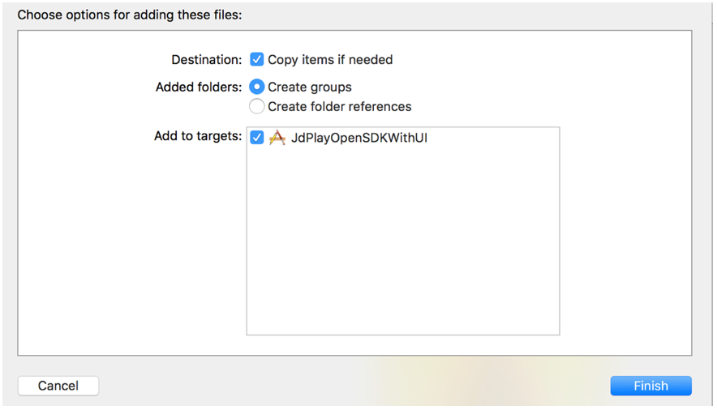

# JdPlaySdk iOS 集成文档

-----

## 变更历史 


| 版本   | 修改记录         |
|--------|------------------|
| V1.0.0 | 初始版本         |
| V1.1.0 | 集成音乐源       |

## JdPlaySdk概述 
JdplaySdk.framework用于局域网内媒体发现和媒体控制。第三方可以采用两种方式接入:
1.基于开放 demo 接入:接入简单,短时间内可接入完成(推荐方 式) 
2.基于开放 SDK 接口接入 

## 基于开放SDK的接入流程 

1. 将 JdplaySdk.framework 拖拽到工程导航视图(project navigator)中的 Frameworks 虚拟目录下。 
在弹出的对话框中按如下图所示勾选:


2. 添加 SDK 依赖的系统库文件。分别是“SystemConfiguration. framework”、“libstdc++.tbd”、“libz.1.2.5.tbd”。另外还 需添加的第三方库有 Reachability、MJRefresh、MJExtension。 

3. 禁用Xcode7下iOS9App传输安全,修复无法连接服务器错误,在项目info.plist中添加一个键“App Transport Security Settings”,类型为 Dictionary,在该 dictionary 下添加一个键“Allow Arbitrary Loads”,类型为Boolean,值为YES,然后保存文件。 

## 注意事项 
1. 本SDK只适用于真机调试

2. 在集成SDK的过程中中要确保 JdPlayManagerInit()先于 updateInterfaceWithReachability:(监测网络状态发生改变调用的方 法)调用,这样才能成功开启底层服务。 
3. 在 AppDelegate.m 文件的方法里加入以下代码,确保程序进入后 台后socket保持长连接,以此达到流畅播控音乐的目的。 
代码如下: 

``` objectc
- (void)applicationDidEnterBackground:(UIApplication *)application { 
    JdPlay_appOnSuspend(); 
    //程序进入后台保持socket长连接

    UIApplication * app = [UIApplication sharedApplication]; 
    __block UIBackgroundTaskIdentifier bgTask;

    
    bgTask = [app beginBackgroundTaskWithExpirationHandler:^{ 
        dispatch_async(dispatch_get_main_queue(),^{ 
        if(bgTask != UIBackgroundTaskInvalid) { 
            bgTask = UIBackgroundTaskInvalid; 
        }}); }]; 
        
    dispatch_async(dispatch_get_global_queue(DISPATCH_QUEUE_PRIOR ITY_DEFAULT,0),^{ dispatch_async(dispatch_get_main_queue(),^{ 
    if(bgTask != UIBackgroundTaskInvalid){ 
        bgTask = UIBackgroundTaskInvalid; 
    }}); }); 
} 
```

最后:用户可根据自己的需求去定制界面,数据的请求与处理详见 Demo。 


