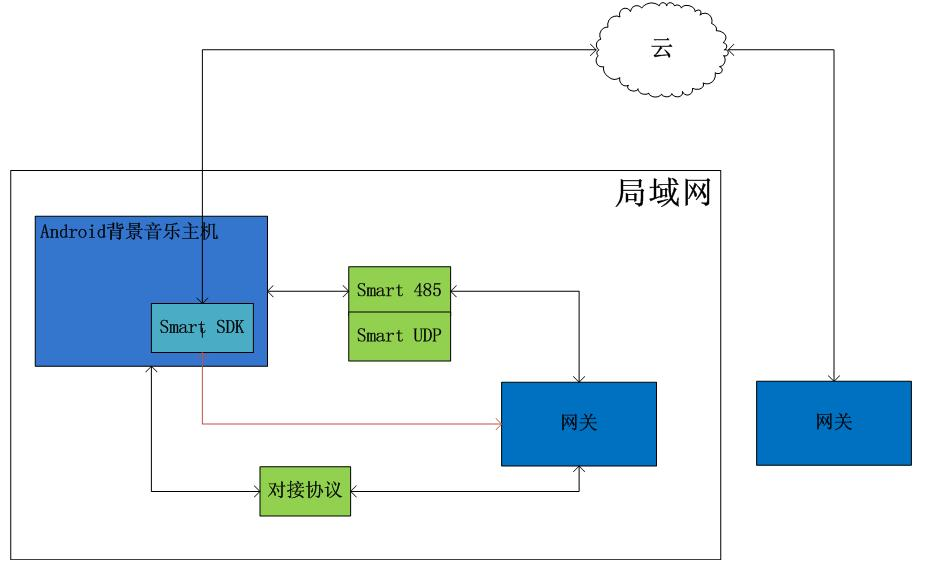
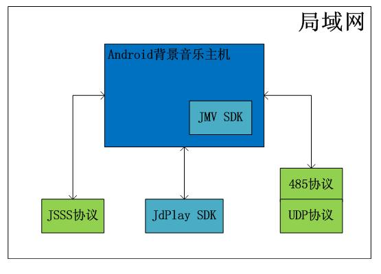

# 一、背景音乐主机控制智能家居

### [Smart sdk 智能家居控制](JdSmartOpenSdk.md)
安卓sdk开发包， 运行于Android背景音乐主机端，方便对接局域网和云端网关

### [对接协议](./files/聚点互动科技有限公司对接协议.pdf)
网络对接协议实现智能家居网关对接，控制智能家居

### Smart 485、udp、tcp
1. [485、udp、tcp控制智能家居内置于Android系统中, 通过界面配置智能设备与场景指令](./files/485控制智能设备指南.pdf) 
2. [485、udp、tcp实现场景音乐播控](./files/485控制场景音乐播控.pdf) 
3. [485、udp、tcp实现播放语音](./files/485播放语音.pdf) 

# 二、控制背景音乐主机

### JMV sdk([Jd_music_and_voice sdk](Jd_music_and_voice_sdk.md))
运行于背景音主机端，语音语义处理，音乐控制, 485控制（请到网盘下载）

### JdPlay sdk（[JdPlay安卓移动端接入](JdPlayOpenSdkAndroid.md)、 [JdPlay苹果移动端接入](./files/JDPlaySDKIOS环境搭建.pdf)）
运行于Android手机端和苹果手机端,开放音乐资源及控制

### [JdPlaySS协议(原JSSS)](JdPlaySS.md)
使用网络协议控制背景音主机，支持局域网发现和控制背景音主机，开放音乐资源及控制，主要用于Linux/RTOS的网关

### [485协议及UDP协议](./JdRS485.md)
通过传统485总线或UDP控制背景音乐主机，开放音乐资源及控制

# 三、 Android开发
### [Android开发注意要点](Android_readme.md)

<!--
## 目录 -->
<!--目录-->
<!--
  * [JdPlay安卓移动端接入](JdPlayOpenSdkAndroid.md)
  * [JdPlay苹果移动端接入](JdPlayOpenSdkIOS.md)
  * [JdPlaySS协议接入](JdPlaySS.md)
  * [RS485控制智能家居设备指南](./files/485控制智能设备指南.pdf)
  * [RS485控制背景音乐协议](./JdRS485.md)
  * [JdSmart设备端智能家居控制接入](JdSmartOpenSdk.md)
-->
<!--  
## 概述

### JdPlay安卓移动端接入
用于Android手机或其它Android终端控制背景音主机，仅支持局域网发现和控制背景音主机

### JdPlay苹果手机移动端接入
用于苹果手机控制背景音主机，仅支持局域网发现和控制背景音主机

### JdPlaySS协议接入
用于Linux／RTOS等终端控制背景音主机，仅支持局域网发现和控制背景音主机

### RS485控制智能家居设备指南
用于RS485方式控制智能家居设备

### RS485控制背景音乐协议
用于RS485方式控制背景音主机

### JdSmart设备端智能家居控制接入
用于背景音主机语音控制第三方智能家居系统，可以把背景音主机理解为智能家居系统的一个安卓手机终端，只要把智能家居安卓App或sdk对接JdSmart Open Sdk，就可以实现语控智能家居系统。

## 使用说明 
一、获取背景音乐主机音乐资源，并控制播放音乐，有如下方式  
1。如下分别适用于手机端Android和Iphone应用
#### JdPlay安卓移动端接入 
#### JdPlay苹果移动端接入

2。适用广泛，通过网络socket协议通信
#### JdPlaySS协议接入

3。适用485总线
#### RS485控制背景音乐协议

二、语音和触摸屏控制智能家居设备
#### JdSmart设备端智能家居控制接入
#### RS485控制智能家居设备指南

-->

